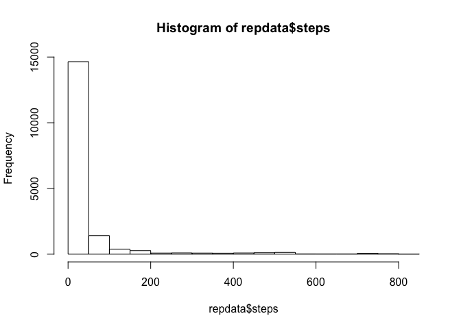

# Reproducible Research: Peer Assessment 1

## Loading and preprocessing the data

```r
setwd("~/Dropbox/Coursera/Reproducible Research/Project 1")
data<-read.csv("Activity.csv", colClasses=c(NA, "Date", NA))
```

## What is mean total number of steps taken per day?

```r
aggDateSum<-aggregate(steps ~ date, data = data, sum, na.action = na.omit)
library(datasets)
hist(aggDateSum$steps)
```

 

```r
# The mean total number of steps taken per day is
mean(aggDateSum$steps)
```

```
## [1] 10766
```

```r
# The median total number of steps taken per day is
median(aggDateSum$steps)
```

```
## [1] 10765
```

## What is the average daily activity pattern?

```r
aggIntMean<-aggregate(steps ~ interval, data = data, mean, na.action = na.omit)
plot(aggIntMean$interval,aggIntMean$steps,xlab="Interval",ylab="Average number of steps",type="l")
```

 


```r
# The 5-minute interval which contains the maximum number of steps is  
aggIntMean$interval[which.max(aggIntMean$steps)]
```

```
## [1] 835
```

## Imputing missing values

```r
# The total number of missing values in the dataset is 
sum(is.na(data$steps)==TRUE)
```

```
## [1] 2304
```

```r
# Create a new dataset that is equal to the original dataset but with the missing data filled in.
repdata<-data
for(i in 1:length(repdata$steps)) {
    if(is.na(repdata$steps[i])) {
        interval <- repdata$interval[i]
        intervalMean <- aggIntMean[aggIntMean$interval==interval,2]
        repdata$steps[i] <- intervalMean
    }
}
aggRepdateSum<-aggregate(steps ~ date, data = repdata, sum, na.action = na.omit)
hist(repdata$steps)
```

 

## Are there differences in activity patterns between weekdays and weekends?

```r
repdata$wday <- "weekday"
repdata$wday[format(repdata$date, "%u") %in% c(6, 7)] <- "weekend"
library(lattice)
xyplot(steps~interval|wday,type="l", data=repdata, layout=c(1,2), xlab="Interval", ylab="Number of steps")
```

 
